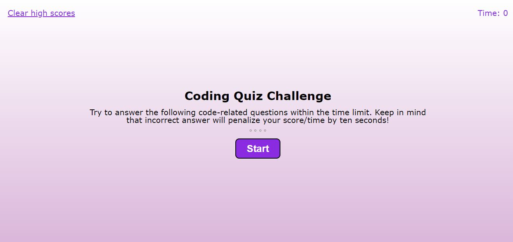

# Programmer Quiz Game

## Table of Contents
* [About](#about)
* [Screenshot](#screenshot)
* [Link](#link)

## About
--------------------------------------------------------------------------------------------------------------------------------------------------------
This website was created using html, css and javascript to create a quiz game for programmers. Correct answers are given 5 points and wrong answers get 10 seconds deducted from the remaining time. There are 10 questions and you can enter your initials into the highscores. 

## Screenshot
--------------------------------------------------------------------------------------------------------------------------------------------------------

## Link
-------------------------------------------------------------------------------------------------------------------------------------------------------
Visit the site! [Programmer Quiz Game](https://teriannephillips.github.io/Programmer-Quiz-Game)